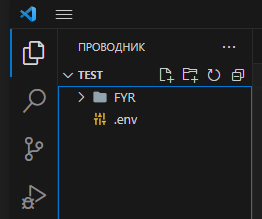

# FYR
## навигация 
:bulb: [Идея](#идея) :bulb:

:computer: [Функционал](#функционал) :computer:

:warning: [Требования](#требования) :warning:

:black_nib: [Установка](#установка) :black_nib:

:question: [Что в планах](#что_в_планах) :question:

 :books: [Источники](#источники)  :books:

:point_right: [Спасибо](#спасибо) :point_left:

:package: [Обновления](#обновления) :package:

## find_your_roof
это бот который позволит вам искать объявления об аренде жилья сразу на 3-ох сайтах с помощью одной кнопки, что позволит вам быстро проверить новинки которые появились

<a name="Идея"></a>

## Идея
Пообщавшись со своим другом который уже много раз снимал квартиру, я понял что хорошие объявления аренды жилья долго не задерживаются на сайте, их разбирают как горячие пирожки. Поэтому  мне пришла в голову идея создать бота, который будет искать объявления сразу на несколький сайтах экономя время. Например можно ехать в метро и нажать на 1 кнопку бота чтоб получить желаемый результат вместо того чтоб заходить на разные сайты и заново задавать параметры. В ходе разговора я узнал какие сайты лучше всего подходят для поиска:
- OLX.ua
- rieltor.ua
- country.ua

<a name="Функционал"></a>

## Функционал

- Регистрация ( в БД хранятся такие данные )
    - id юзера
    - город для поиска
    - цена min/max
    - количество комнат (max 3)
    - этаж min/max
    - желаемая сортировка
    - после каждого поиска даётся "бан" на 1 минуту для предотвращения спама
- Возможность менять сохранённые данные
- удобная клавиатура для быстрого ввода

<a name="Требования"></a>

## Требования
- Python 3.9
- SQLAlchemy==1.3.24 \ gino==1.0.1 !!
- PostgreSQL 14+
- firefoxм 114+ ( для парсинга olx ), а также geckodriver v0.33.0

<a name="Установка"></a>

## Установка
( Для windows без докера )
1. Откройте свою IDE
2. Устаноите проект с помощью терминала и команды 
```
git clone https://github.com/ZHMESHNECK/FYR.git
```
3. перейдите в папку FYR командой
```
cd FYR
```
4. Установите виртуальную среду. Например:
```
python -m venv venv
```
5. скачиваем библиотеки
```
pip install -r requirements.txt
``` 
6. Создаём файл `.env` за папкой FYR

,

- содержимое `.env` выглядит таким образом
```
TOKEN='YOUR_API_KEY'

# PostgreSQL
POSTGRES_HOST=localhost
POSTGRES_PORT=5432
POSTGRES_DB=NAME_TABLE
POSTGRES_USER=USER_NAME
POSTGRES_PASSWORD=PASSWORD
WINDOWS=Path:\to\browser
LINUX=Path/to/browser
LINUX_DRIVER=Path/to/geckodriver
```
6. Заходим в `utils/olx_par.py` на 20 строчку и указываем свой путь к firefox
7. Переходим в файл `__main__.py` и запускаем 
8. Готово! :heavy_check_mark: приятного пользования


<a name="Что в планах"></a>

## Что_в_планах
- [x] Интеграция Docker
- [ ] Добавить возможность выбора района
- [ ] Возможность сохранять объявления

<a name="Источники"></a>

## Источники
- https://www.youtube.com/@Redlyy
- https://www.youtube.com/@PythonToday
- https://www.youtube.com/@massonnn

<a name="Спасибо"></a>

## Спасибо
- [vladfraer1](https://t.me/vladfraer1) ( тест )
- [Itkitko](https://t.me/Itkitko) ( тест )
- [TOMAS](https://t.me/Teuieieie) ( тест )

<a name="Обновления"></a>

## Обновления

ПР - переходное обновление ( Используется для синхронизации проекта WIN\LINUX )

version 1.8.5
- Вес для Docker контейнера уменьшен до 1.15ГБ

version 1.8.4
- Исправлена ошибка при не верном пути к драйверу браузера для olx
- Версия python в Docker заменена на alpine для облегчения контейнера
- Пути к браузерам перенесены в .env

version 1.8.3
- Добавлены dockstring в функции

version 1.8.2
- Исправлена отправка 2-х сообщений при пустом поиске
- Обновлён /help ( добален Linux )
- Рабочая версия парсинга olx для Docker

version 1.8.1
- Рабочая версия запуска бота в docker (без парсинга olx)

version 1.8.0
- Изменена архитектура проекта
- Добавлен alembic ( миграции )
- Убран fake-useragent

version 1.7.9
- ПР

version 1.7.8
- Добалены файлы для Docker

version 1.7.7
- РЕЛИЗ
- Обновлено подключение к БД
- убрана проверка на этаж ( <=20 )
- Улучшен механизм обхода рекламы в olx, rieltor

version 1.7.6
- ПЕРЕХОДНОЕ ОБНОВЛЕНИЕ ( разрыв соединения с DB )
- Улучшен механизм обхода рекламы в country
- мелкие правки

version 1.7.5
- bag fix с неправильным ответом в изменении параметра / начало регистрации isinstance
- Подкоректирован /help
- Добавлена проверка min <= max для цены и этажа в обе "регистрации"
- Добавлена проверка этажа не выше 20-го в обе "регистрации"
- Исправлена генерация ссылки olx ( сортировка )

version 1.7.4
- В одиночном изменении параметра доработан пункт "Пропуск"
- Исправлен баг с не показом объявлений на rieltor
- Изменён return в функции `registration`

version 1.7.3
- Добавлен requirements.txt
- Разработка README.md

version 1.7.2
- Добавлена блокировка на 1 минуту после начала успешного поиска для предотвращения спама
- Проверка на бан в 1 минуту
- Добавлена новая колонка в БД ( время начала поиска )

version 1.7.1
- Доработаны специфичные запросы где меньше 8 объявлений или ничего не найдено за запросом

version 1.7.0
- Изменена система парсинга на olx
    - добавлены 5 рабочих fake_user_agent
- Исправлена ошибка при "отмене" изменений

version 1.6.9
- Добавлена внешка бота
- Исправлен баг при указании цены выше 10к в основной регистрации

version 1.6.8
- Исправлена ошибка при генерации ссылки на rieltor для 2-х комнат

version 1.6.7
- Изменена структура расположения файлов
- Исправлен баг при указании цены выше 10к в изменениях параметров
- Кнопка "Отмена" в изменении 1 параметра теперь работает

version 1.6.6
- Полностью рабочие варианты с rieltor, country

version 1.6.5
- Параметры ссылки для rieltor, country
- Полностью рабочий вариант с olx

version 1.6.4
- Добавлены заготовки городов для генерации ссылок
- Параметры ссылки для olx

version 1.6.2/ 1.6.3
- Изменён тип сроки count_rooms в дб на str
- Добавлены проверки на входящие данные

version 1.6.1
- Добавлена возможность менять параметры у существующего юзера
- Обнаружен баг при указании нескольких комнат

version 1.6
- Рабочая сырая регистрация юзеров без проверок

version 1.5.1
- Изменена архитектура расположения файлов 
- Добавлены заготовки для регистрации и подключении к базе
- Исправлена ошибка по архитектуре import
- Ошибка при подключении к базе данних

version 1.5
- Добавлены заготовки для регистрации юзеров, а так же связь с БД

version 1.4.1
- Добавлена заготовка для olx, генерация ссылки с параметрами
- Исправлены недочёты в генерации ссылки для rieltor

version 1.4
- Добавлена заготовка для rieltor, генерация ссылки с параметрами
- Добавлен config файл с городами

version 1.3
- Обновлён механизм ожидания на olx

version 1.2
- Добавлен сайт country.ua

version 1.1
- Рабочий бот по riel , olx. Параметры по статичному шаблону
